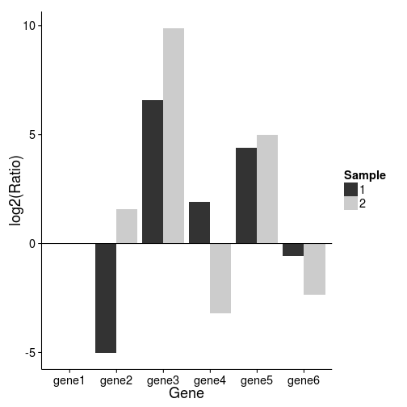

## Enter shiny! qPCR 
https://dlow.shinyapps.io/qpcr/


--- .class #id 
## Under the hood
shiny! qPCR takes in a table of Ct values & computes means and standard deviations


```r
dataset # your upload file will contain this
```

```
##       cond1_1 cond1_2 cond1_3 cond2_1 cond2_2 cond2_3
## gene1    21.0    20.8    20.5    21.5    22.0    22.0
## gene2    26.0    25.4    26.0    20.0    20.3    20.5
## gene3    14.0    14.0    14.5    12.0    11.8    12.0
## gene4    19.0    18.6    19.0    25.0    25.1    25.0
## gene5    16.6    16.5    16.0    17.0    17.0    16.5
## gene6    21.0    21.5    21.5    24.0    24.5    24.0
```

```r
# compute mean and stdev
group<-rep(1:2,each=3)
dvals<-do.call(cbind,by(t(dataset),group,function(x) colMeans(x)))
dst<-do.call(cbind,by(t(dataset),group,function(x) apply(x,2,sd)))
```

--- &twocol
*** =left

```r
dvals # means
```

```
##           1     2
## gene1 20.77 21.83
## gene2 25.80 20.27
## gene3 14.17 11.93
## gene4 18.87 25.03
## gene5 16.37 16.83
## gene6 21.33 24.17
```

```r
dst # standard deviations
```

```
##            1       2
## gene1 0.2517 0.28868
## gene2 0.3464 0.25166
## gene3 0.2887 0.11547
## gene4 0.2309 0.05774
## gene5 0.3215 0.28868
## gene6 0.2887 0.28868
```

*** =right
## Plot
 

---
## References
* http://www.lifetechnologies.com/sg/en/home/life-science/pcr/real-time-pcr/qpcr-education/pcr-understanding-ct-application-note.html
* http://www3.appliedbiosystems.com/cms/groups/mcb_support/documents/generaldocuments/cms_042380.pdf

## Thank you for your attention!
* dlow@imcb.a-star.edu.sg
* https://dlow.shinyapps.io/qpcr/
